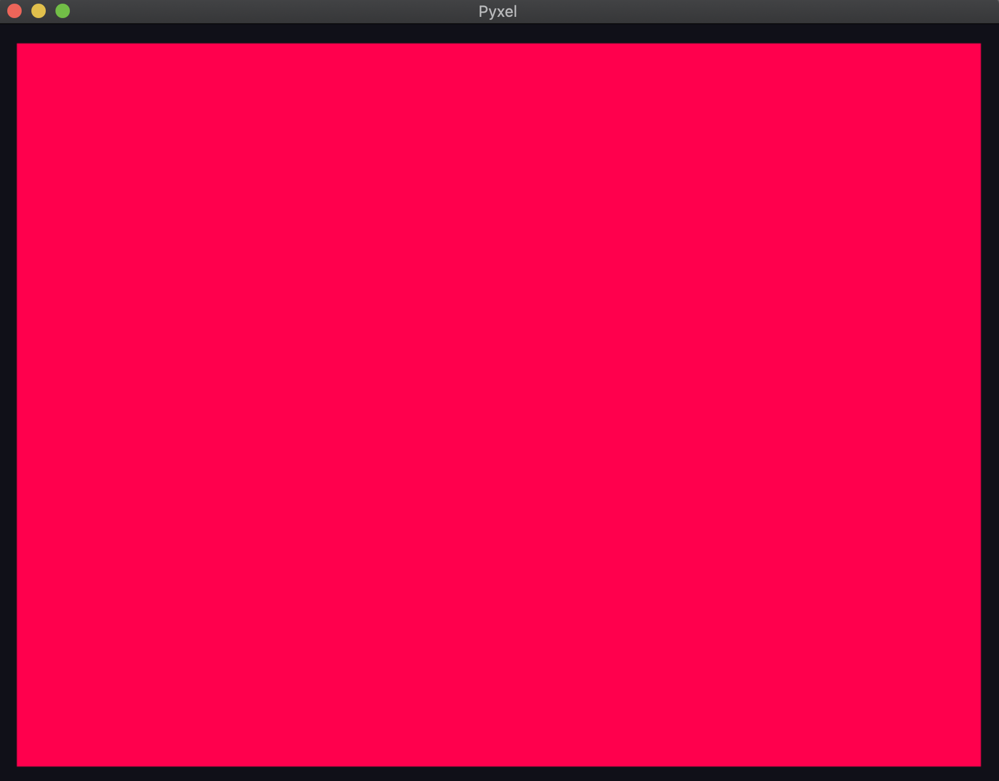

# Pyxel入門
Pyxel(ピクセル)はPythonで作るレトロゲーム環境です.

レトロゲームの定義について世代によって変わると思いますが.
ここではファミコン程度のスペックと考えてください.

Pyxelは意図的に使用できるリソースに制限をかけています.
具体的には,画面上に使用できる色数が**16色**,
同時再生可能な音は**4音**です.

公式の資料もありますのでより詳しい内容については

[こちら](https://github.com/kitao/pyxel/blob/5dec75ded65376930d23523e1fd85a2e91b0bfb8/README.ja.md)

## インストール

もし自分のPCでやるなら[Pycharm](https://www.jetbrains.com/ja-jp/pycharm/)がおすすめです!

pythonのバージョンは3.7以上が必要です

pyxelのインストールはUbuntuであれば,
```shell script
sudo apt install python3 python3-pip libsdl2-dev libsdl2-image-dev
sudo -H pip3 install -U pyxel
```

## インポート

pyxelを使用するためにはpythonにライブラリ(パッケージ)として
pyxelを`import`する必要があります.

```python
import pyxel
```

## 01-画面の立ち上げ
`pyxel`をimportしたら描画する画面を表示します.

`pyxel.init`関数で画面の設定を行います.
`pyxel.run`関数でアプリとして開始します.
`pyxel.run`では更新関数と描画関数を渡す必要があります.

更新関数は定期的に呼ばれる関数です.一般的にはゲームであれば60fps(1秒間に60回60フレーム)
or 30fpsで更新します.(fpsは自分で変更できます)

描画関数は画面に描画する処理についての関数です.この関数で何を描くかを設定します.


[01_open_window.py](01_open_window.py)
```python
import pyxel

def update():
    pass
def draw():
    pass
pyxel.init(160,120)
pyxel.run(update,draw)
```
上のコードで画面を表示します.


## 02-背景色の変更

画面が表示されました.現在は背景が黒なので,
`draw`関数を変更して背景色を変更します.

```python
def draw():
    pyxel.cls(8)
```

```python
import pyxel

def update():
    pass
def draw():
    pyxel.cls(8)
pyxel.init(160,120)
pyxel.run(update,draw)
```
[02_draw_background.py](02_draw_background.py)


色が変わりました.ところで`pyxel.cls(8)`のclsは**Cl**ear **S**creenの
ことですが,`8`とはなんでしょうか? これはデフォルトのカラーパレットの色を指定しています.


`8`はつまりカラーパレットの`8`(255,0,77)のことを指しています.

他の色を使いたい場合は[こちらを参考にしてください](#10-初期設定を変更する)

## 02-テキストを描画する
テキストの描画は`pyxel.text(x,y,str,col)`でできます.
引数は x座標,y座標,テキスト,カラーパレットの値です.

画面の左上に`(^ ^)`と表示してみます.

```
import pyxel
def update():
    pass
def draw():
    pyxel.cls(7)
    pyxel.text(0, 0, "(^ ^)", 1)
    pyxel.text(140, 110, "(^ ^)", 1)


pyxel.init(160, 120)
pyxel.run(update, draw)
```
[03_draw_text.py](03_draw_text.py)


画面から分かる通り,描画の座標位置は左上を(0,0)とする座標系です.
デフォルトではフォントサイズは固定(width,height)=(5,5),
表示できる文字はデフォルトではASCIIのみ だと思われます.


## 04-動きをつける
背景色を変更し,テキストを描画することができました.

次にこのテキストを動かしてみます.ここでようやくupdate関数を使用します.
テキストを動かすにはx,y座標を変更することで実現可能です.
今まではx,y座標に定数を指定していましたが,変更するためには変数として宣言する必要があります.

このため,x,yを変数として宣言します.

```python
import pyxel
x, y = 0, 0
def update():
    global x, y
    x += 1
    y += 2
def draw():
    pyxel.cls(7)
    pyxel.text(x, y, "(^ ^)", 1)
pyxel.init(160, 120)
pyxel.run(update, draw)

```
[04-1_move_text.py](04-1_move_text.py)

ここでは変数をグローバルに宣言しているため,値を変更する際に少し特殊な書き方になっています.

この動きは画面外に出ると戻ってきません.なので`update`関数を変更して,画面外に出たら
戻るようにしましょう.


```python
import pyxel
width,height =160,120
x, y = 0, 0
def update():
    global x, y
    x = (x+1)%width
    y = (y+2)%height
def draw():
    pyxel.cls(7)
    pyxel.text(x, y, "(^ ^)", 1)
pyxel.init(width, height)
pyxel.run(update, draw)

```
[04-2_rollback_text.py](04-2_rollback_text.py)


これで常に画面上にテキストが動き回ります.

画面の幅と高さを変数で宣言して`pyxel.init`に設定しましたこれでwidth,heightを変更する
と画面のサイズを変更することができます.

`update`関数内の`%`は剰余演算です.つまり`x`を`width`で割った時の余を返します.
値は常にwidth以下です.


## 05-画像を表示する
pyxelは一般画像フォーマットでは`png`にしか対応していませんので`jpg`などの画像フォーマットでは
あらかじめ変換しておく必要があります.
また,pyxelの仕様上画像は3つ,タイルマップであれば8つまでしか同時に保持しておくことができず,
画像の最大サイズは256x256です.

画像の色も16色のカラーパレット内の近似色に自動的に変換されます.


画像を表示するためにはまず画像を読み込む必要があります. 画像が読み込み後
`draw`関数内で`pyxel.blt`で描画できます.

```python
import pyxel

width, height = 160, 120
pyxel.init(width, height)
pyxel.image(0).load(0, 0, "asset/dvd-32.png")
def update():
    pass

def draw():
    pyxel.cls(7)
    pyxel.blt(0,0,0,0,0,32,32)

pyxel.run(update, draw)

```

[05-1.draw_img.py](05-1.draw_img.py)


`pyxel.image(0)`で画像を保存する画像バッファ(メモリ)を決定.前述の通り3つしか使えないので,
0~2以外の値を入れるとエラーが発生します.画像バッファに対して`load`で読み込む画像を設定します.
最初の2つの引数は256x256の画像バッファ内に画像を置く時の左上からのオフセットになります.

イメージとしては以下の感じです.


画像を読み込む前に`pyxel.init`を先に実行して初期化する必要があります.

画像が読み込まれたら`draw`関数で画像を描画します.`pyxel.blt`で描画します

`pyxel.blt(x, y, img, u, v, w, h)`

x,yは画面内で描画する位置,imgは使用する画像バッファ(0~2)
u,vは画像バッファ内の描画の開始点,w,hは画像バッファ内の 幅,高さになります.

なぜ,バッファ内の位置とサイズを指定する必要があるのか疑問を持つ人もいると思いますが.
これは,画像内に複数の画像(スプライト）が配置されていてそれを切り出して使う時とかなどに
重宝します.テクスチャアトラスとかパッキングとも呼ばれているもので,
スプライトを1つの画像にまとめる事で画像のロードにかかる時間の削減などパフォーマンス
の向上につながります.

今回ではそれほど気にする必要はありませんがそういう理由でこのような関数になっています.


画像を動かして例のDVDの待機画面を作ります.

```python
import pyxel

x, y = 1, 1
w, h = 32, 32
vx, vy = 1, 1
width, height = 160, 120
pyxel.init(width, height)
pyxel.image(0).load(0, 0, "asset/dvd-32-black.png")

def update():
    global x, y, vx, vy
    if (x) < 0:
        vx = 1
    elif (x + w) > width:
        vx = -1
    if (y) < 0:
        vy = 1
    elif (y + h ) > height:
        vy = -1

    x += vx
    y += vy


def draw():
    pyxel.cls(0)
    pyxel.blt(x, y, 0, 0, 0, w, h,colkey=1)

pyxel.run(update, draw)
```

[05-2.dvd.py](05-2.dvd.py)


`update`関数でDVDの衝突判定を行っています.
DVDが画面外に出てしまった時x,yの速度を変える事で反転させています.


### その他の描画関数
[03_draw_api.py](https://github.com/kitao/pyxel/blob/master/pyxel/examples/03_draw_api.pyhttps://github.com/kitao/pyxel/blob/master/pyxel/examples/03_draw_api.py)
を参照.
## 06-入力に対応する

キーボード,マウスの入力に対して反応できるようにします.

キーボード入力(ボタン)には3種類の関数が用意されています.
`btn(key)`,`btnp(key,[hold],[period])`,`btnr(key)`

`btn`は1フレームに,あるキーが押されていればにTrue,押されていなければFalseを返します
`btn`はキーが押されている時は常にTrueを返すので,キーを一回だけのイベントにする場合は
`btnp`で実現可能です.

`btnp`は前述の通り引数に`key`のみを与えた場合,あるキーを押したフレームでTrueを返し
それ以降では一度キーを離して再度押さない限りTrueを返しません.

引数`hold,period`を追加で与えた場合,キーを押したフレームで一度Trueを返し,
その後`hold`フレーム後に1度Trueを返しその後`period`フレームごとにTrueを返します.
これは,チャージショットといったチャージする際に使用すると良いでしょう.

`btnr`はキーが離れたときのみTrueを返します.


マウス入力では`mouse_x`,`mouse_y`が用意されています.
その名前の通り,1フレームでの画面上のマウスの位置を取得できます.

pyxelは初期状態でfpsは30なので30フレーム更新されたら1秒経過したことになります.

入力を使う事でプレイヤを移動させたり,選択させることができるようになります.

[06-input.py](06-input.py)ではWASDで左右上下移動,Z,Xで
拡大縮小,押しっぱで連続拡大,マウスの移動部分に追従を実現しています.


## 07-音を鳴らす
pyxelでは同時に再生することができる音は最大4音.
サウンド(シーケンス)は64までバッファに入れることができます.

サウンドは音程(周波数)と音色(信号の形)音量,エフェクト,1音の長さから
構成される古典的な方法で構成されます.
このため`mp3`や`wav`といった音楽ファイルからは読み込むことはできません.

サウンドはノーツ(音符)を文字列から構築します.

この章ではカエルの合唱を元にサウンドを試していきます.

カエルの合唱は

ドレミファミレド,ミファソラシラファミ,ド,ド,ド,ドレミファミレド

となります.これを実際にpyxelに打ち込むには
'CDEFGAB'+'#-'+'0123'or'Rで表現します.
これは英語表記によるものです.詳細についての作曲の基礎について調べてみてください.
ドレミファミレは CDEFGABになります.

実際にカエルの合唱を演奏してみます
```python
import pyxel
def update():
    pass
def draw():
    pyxel.cls(0)
pyxel.init(200,150)

pyxel.sound(0).set(
    "C2D2E2F2E2D2C2C2 E2F2G2A2G2F2E2E2 C2C2  C2C2  C2C2  C2D2E2F2E2D2C2C2 ",
    "S",
    "6",
    "",
    120
)
pyxel.play(0,0,loop=True)
pyxel.run(update,draw)
```

`pyxel.sound(0)`で設定するサウンドのバッファを指定し,音符を指定しました.

これの実際の音声がこちらです.

1音ごとの長さが長いので変更します`pyxel.set(note, tone, volume, effect,
speed)` のspeedを早くします.`speed=120`で1秒なので1音0.5秒=60にします.

```python
pyxel.sound(0).set(
    "C2D2E2F2E2D2C2C2 E2F2G2A2G2F2E2E2 C2C2  C2C2  C2C2  C2D2E2F2E2D2C2C2 ",
    "S",
    "6",
    "",
    60
)
```
実際の音声


次に,`C2C2 C2C2 C2C2`のところは演奏時に繋がっているのでエフェクトをかけます.

`pyxel.set(note, tone, volume, effect,speed)`の`effect`を設定します.
エフェクトは一音ごとに設定する必要があります.

(N:None ,S:Slide V:Vibrato, F:FadeOut)で表現します.

```python
pyxel.sound(0).set(
    "C2D2E2F2E2D2C2C2 E2F2G2A2G2F2E2E2 C2C2  C2C2  C2C2  C2D2E2F2E2D2C2C2 ",
    "S",
    "6",
    "NNNNNNNN NNNNNNNN NF NF NF  NNNNNNNF",
    60
)

```

これでカエルの歌っぽく演奏できました.
[07-sound.py](07-sound.py)が最終形のコードです.
他にはtoneを変えて演奏してみます.(T:Triangle , S:Square ,P:Pulse , N:Noise)
で表現されます.
toneは信号の波形を設定します.


## 08-オブジェクト指向で書く

これまでは,`update`,`draw`関数を定義し動作を記述していましたが,
ゲームを作成する際にはプレイヤや敵,アイテムといった複数の
要素が存在します.これをオブジェクトごとに`update,draw`関数を
定義したclassで実装することでそれぞれのオブジェクトをタイプごとに
抽象化します.

3つのオブジェクトを定義します.

| 名前|概要|
| --- | --- |
| Player | 操作できる,縦横に移動できる.HPが無くなると死ぬ|
| Enemy| 勝手に移動する,Playerに接触するとPlayerにダメージを与える|
| Item | Playerに接触するとPlayerのHP回復する|

さらに,オブジェクト全体を管理するAppクラスを定義します.

[08-object-orientation.py](08-object-orientation.py)

画像はGIMPで一枚の画像に配置し,`pyxel.blt`でu,v,w,hを指定することで
画像内のスプライトを描画します.

```python
 def update(self):
        for obj in self.objects:
            if obj.alive:
                obj.update()
        for obj in self.objects:
            if not obj.alive:
                continue

            if self.player.tag != obj.tag:
                col_result = collision_detection(self.player, obj)
                if col_result["col"]:
                    self.player.collision(col_result["obj"])


```
Appの`update`関数ではオブジェクトにalive(生存)フラグを確認し,生存している場合のみupdateを行います.
`draw`関数でも同様にalive==Trueの時のみ描画します.

`update`関数ではプレイヤと他のオブジェクトの衝突判定を行っています.
オブジェクト間の判定は円で行い,衝突した場合aliveフラグを変更します.

```python
# 円同士のあたり判定
def collision_detection(src, target):
    l = (src.x - target.x) ** 2 + (src.y - target.y) ** 2
    rr = (src.r + target.r) ** 2
    if l <= rr:
        return {"obj": target, "col": True}
    else:
        return {"obj": None, "col": False}
```

```python
  def collision(self, obj):
        print(obj.tag)
        if obj.tag == "Enemy":
            obj.alive = False
            self.hp -= 1
        elif obj.tag == "Item":
            obj.alive = False
            self.hp += 1
```

オブジェクト指向で記述することで各オブジェクトごとに動作を記述しやすくなったり,
`update`,`draw`関数をどのオブジェクトにも定義することで各オブジェクト間の動作を
抽象化できるなどの利点があります.一方でオブジェクト間の参照が面倒になるなどの
欠点もありますこのため,作成する前に設計をよく考えておくことも重要となります.

## 10-初期設定を変更する

`pyxel.init(width, height, [caption], [scale], [palette], [fps], [border_width], [border_color], [quit_key]`
でpyxelの初期設定を変更できます.

`width`,`height`で画面サイズを変更できます.サイズは　`0~256`です.

`caption`はウィンドウのタイトルを設定できます.

`scale`は画面の拡大縮小ができます.

`fps`はゲームの更新間隔を変更します.
`pallete`はゲームで使用する　16色を変更できます.

デフォルトの16色は

`Palltte ['0x0', '0x1d2b53', '0x7e2553', '0x8751', '0xab5236', '0x5f574f', '0xc2c3c7', '0xfff1e8', '0xff004d', '0xffa300', '0xffec27', '0xe436', '0x29adff', '0x83769c', '0xff77a8', '0xffccaa']`

ですがこれを変更できます.
パレットの色フォーマットはintのListでサイズが16です.
各色はRGBで0~7が青,8~15が緑,16~23が赤で表現されています.

そのため16進数表現では原色の赤は`0xff0000`になります.


`border_width`,`border_color`はゲームの周りの枠線のサイズと色を変更します.
`quit`はゲーム終了のショートカットを変更できます.

[10-init.py](10-init.py)に最終のソースを示します.

## 使用アイコン

Icons made by <a href="https://www.flaticon.com/authors/monkik" title="monkik">monkik</a> from <a href="https://www.flaticon.com/" title="Flaticon"> www.flaticon.com</a>
Icons made by <a href="https://www.flaticon.com/authors/srip" title="srip">srip</a> from <a href="https://www.flaticon.com/" title="Flaticon"> www.flaticon.com</a>
Icons made by <a href="https://www.flaticon.com/authors/freepik" title="Freepik">Freepik</a> from <a href="https://www.flaticon.com/" title="Flaticon"> www.flaticon.com</a>